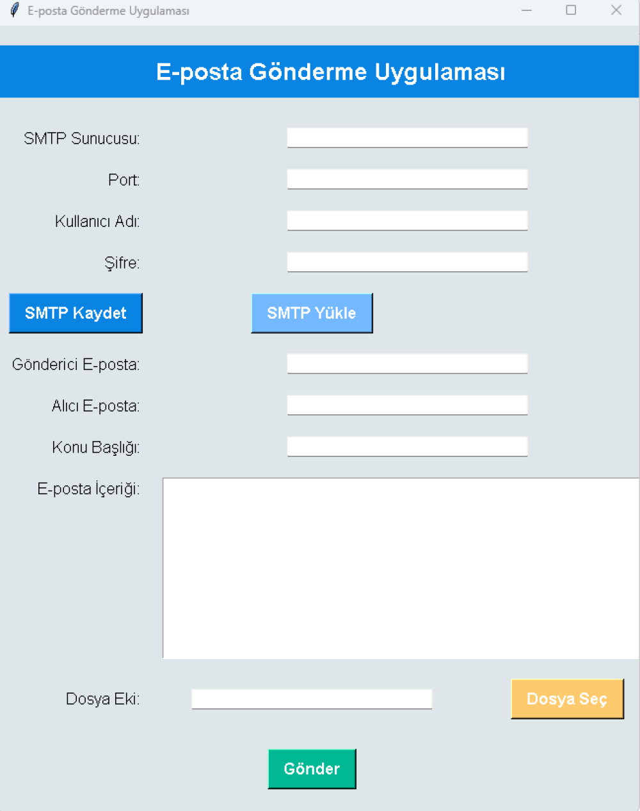

# Python ile Gelişmiş E-Posta Gönderme Uygulaması

Bu uygulama, Python kullanarak kolayca e-posta göndermenizi sağlayan gelişmiş bir araçtır. SMTP bilgilerini kaydetme, yükleme, dosya ekleme, ilerleme çubuğu ve gönderilen e-postaları loglama gibi birçok özellik sunar.

## Özellikler

- **SMTP Bilgilerini Kaydetme ve Yükleme:**
  - SMTP sunucusu, port, kullanıcı adı ve şifre bilgilerinizi kaydedebilir ve daha sonra tekrar yükleyebilirsiniz.
- **Dosya Ekleme:**
  - E-postalarınıza bir veya daha fazla dosya ekleyebilirsiniz.
- **İlerleme Çubuğu:**
  - E-posta gönderilirken işlemin ilerlemesini gösteren bir ilerleme çubuğu mevcuttur.
- **Gönderilen E-postaları Loglama:**
  - Gönderilen e-postalar, gönderici, alıcı ve konu bilgileriyle birlikte loglanır.
- **Estetik ve Kullanıcı Dostu Arayüz:**
  - Mavi ve beyaz renk temasına sahip, estetik açıdan hoş bir kullanıcı arayüzü sunar.
- **E-posta İmzalama:**
  - E-postalarınıza gönderen adıyla birlikte bir imza ekleyebilirsiniz.

## Ekran Görüntüsü

## Kurulum Talimatları

### Kullanım

1. **SMTP Bilgilerini Girin:**
   - SMTP sunucusu, port, kullanıcı adı ve şifre bilgilerinizi girin.
2. **E-posta Bilgilerini Girin:**
   - Gönderen e-posta adresi, alıcı e-posta adresi, konu ve e-posta içeriğini doldurun.
3. **Dosya Ekleyin (Opsiyonel):**
   - "Dosya Seç" butonuna tıklayarak e-postanıza dosya ekleyin.
4. **SMTP Bilgilerini Kaydet/Yükle:**
   - Girdiğiniz SMTP bilgilerini kaydedebilir ve daha sonra tekrar yükleyebilirsiniz.
5. **E-postayı Gönderin:**
   - "Gönder" butonuna tıklayarak e-postanızı gönderin. Gönderim sürecini ilerleme çubuğundan takip edebilirsiniz.

## İletişim

Bu uygulama hakkında daha fazla bilgi almak için [Eka Sunucu](https://www.ekasunucu.com/yazilim/python-ile-gelismis-e-posta-gonderme-uygulamasi) sayfasını ziyaret edebilirsiniz.

Yazılım çözümleri ve diğer projeler hakkında daha fazla bilgi almak için [Eka Sunucu](https://www.ekasunucu.com/) ve [Eka Yazılım](https://ekayazilim.com.tr) sitelerine göz atabilirsiniz.

VDS hizmetleri için [VDS Satın Al](https://www.ekasunucu.com/kategori/turkiye-lokasyon-vds-vps) sayfasını, ekran kartlı sunucu hizmetleri için [Ekran Kartlı Sunucu](https://www.ekasunucu.com/kategori/ekran-kartli-sunucu) sayfasını ziyaret edebilirsiniz.

İletişim:  
E-posta: [info@ekayazilim.com.tr](mailto:info@ekayazilim.com.tr)  
Telefon: 0850 307 34 58
